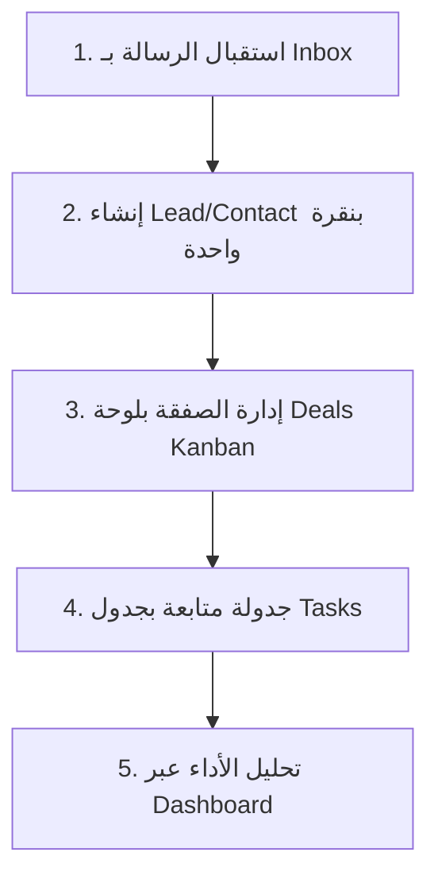

# دليل العرض التقديمي وسيناريو تشغيل نظام MaVoid WhatsApp CRM 🚀

مرحباً بك في الدليل التعريفي وسيناريو العرض التجريبي (Demo Scenario) المخصص لشرح وتوضيح آلية عمل النظام لأصحاب المصلحة والمستثمرين والمطورين. هذا المستند يمثل خطة عرض متسلسلة تبدأ بمشكلة العمل الواقعية وتنتهي بالحل المتكامل الذي يقدمه النظام.

---

## 🎭 المقدمة وقصة المشروع (The Elevator Pitch)

> **"تخيل لو أن فريق المبيعات لديك يستطيع إدارة كامل الصفقات، الشركات، العملاء المحتملين، وجدولة المتابعات دون مغادرة صندوق محادثات واتساب أبداً!"**
>
> في الأنظمة التقليدية، يضيع وكيل المبيعات بين شاشة واتساب للمحادثة وشاشة الـ CRM لتسجيل البيانات، مما يؤدي لضياع 30% من البيانات وتأخر المتابعات. 
> نظام **MaVoid WhatsApp CRM** يحل هذه المشكلة جذرياً عبر دمج قنوات الاتصال المباشرة مع نظام إدارة علاقات العملاء (CRM) للشركات (B2B) في واجهة موحدة، سلسة وتعمل في الوقت الفعلي.

---

## 🎬 سيناريو العرض الفعلي خطوة بخطوة (Step-by-Step Demo Flow)

### 📍 المحطة الأولى: استقبال الرسائل وصندوق الوارد المشترك (Shared Inbox)
*   **ماذا تعرض؟** شاشة الـ Shared Inbox (`/inbox`).
*   **السيناريو والشرح للمستمعين:**
    1. "هنا يبدأ كل شيء؛ محادثة واردة من عميل مهتم بخدماتنا تصل مباشرة عبر الـ Webhook إلى النظام وتظهر في شاشة الـ Inbox في الوقت الفعلي."
    2. "يظهر لدينا الاسم، رقم الهاتف، ومعاينة سريعة لآخر رسالة مع إشعار بعدد الرسائل غير المقروءة."
    3. "في الجانب الأيسر، هناك لوحة مخصصة للتحكم بالـ CRM، والتي تُظهر حالياً خيارين سريعين للتحويل."

---

### 📍 المحطة الثانية: التحويل والربط الذكي بنقرة واحدة (Instant Conversion)
*   **ماذا تعرض؟** النقر على زر "إنشاء فرصة مبيعات" أو "إنشاء جهة اتصال" من داخل المحادثة والانتقال التلقائي.
*   **السيناريو والشرح للمستمعين:**
    1. "العميل مهتم بعرض أسعار؟ بدلاً من الذهاب يدوياً لنسخ رقمه وبياناته، يقوم الوكيل بالضغط على **Create Direct Sales Lead**."
    2. "ينقله النظام تلقائياً لشاشة الفرص (`/leads`) مع فتح لوحة الإضافة الجانبية معبأة مسبقاً برقم هاتف العميل تلقائياً."
    3. "نقوم بإدخال اسم الفرصة (مثال: 'صفقة ترخيص نظام سحابي للرياض') وقيمتها المالية، وبنقرة واحدة يتم حفظها وربطها بالعميل."

---

### 📍 المحطة الثالث: لوحة التحكم بالصفقات المبيعية (Deals Kanban Board)
*   **ماذا تعرض؟** شاشة الصفقات (`/deals`).
*   **السيناريو والشرح للمستمعين:**
    1. "الآن ننتقل إلى شاشة الصفقات المبيعية. كما ترون، لدينا واجهة Kanban تفاعلية وذكية مقسمة إلى 6 مراحل تبدأ من (فرصة جديدة) وتنتهي بـ (مكسب/خسارة الصفقة)."
    2. "يقوم النظام تلقائياً بحساب القيمة الإجمالية للصفقات داخل كل مرحلة مبيعية في أعلى العمود ليمنح مدير المبيعات رؤية فورية لحجم الأنبوب المبيعي (Pipeline Valuation)."
    3. "يمكن للوكيل نقل الصفقة وترقيتها للمرحلة التالية بمرونة تامة لتعكس حالة المفاوضات مع العميل."

---

### 📍 المحطة الرابعة: المتابعات المستمرة والملاحظات الزمنية (Tasks & Notes)
*   **ماذا تعرض؟** لوحة المهام المبيعية (`/tasks`) وقسم إضافة الملاحظات.
*   **السيناريو والشرح للمستمعين:**
    1. "الصفقة لن تكتمل دون متابعة. ننتقل لشاشة المهام، حيث يتم جدول المهام ومتابعتها مع تحديد جهة الاتصال والصفقة المربوطة وتاريخ الاستحقاق."
    2. "المهام التي تجاوزت تاريخ استحقاقها تظهر فوراً بعلامة تنبيه حمراء صارخة (**Overdue**) لضمان ألا ينسى الوكيل موعداً هاماً."
    3. "كما يمكننا إضافة ملاحظات زمنية ملحقة مباشرة بملف العميل لتوثيق تفاصيل الاجتماعات والاتصالات السابقة."

---

### 📍 المحطة الخامسة: لوحة البيانات والتحليلات الشاملة (Sales Dashboard)
*   **ماذا تعرض؟** الشاشة الرئيسية للوحة البيانات (`/dashboard`).
*   **السيناريو والشرح للمستمعين:**
    1. "هنا تتبلور جميع البيانات في واجهة تحليلية واحدة للمدراء والتنفيذيين."
    2. "تعرض الـ Dashboard مؤشرات أداء حية ودقيقة (Real-time Metrics) يتم حسابها إحصائياً مباشرة من قاعدة البيانات:"
        *   **المحادثات المفتوحة**: حجم الرسائل النشطة حالياً.
        *   **الصفقات الجارية**: عدد الفرص النشطة في الأنبوب المبيعي.
        *   **القيمة المالية للأنبوب (Pipeline Value)**: مجموع القيم المالية لجميع الصفقات غير المنتهية.
        *   **المهام المتأخرة**: تنبيه فوري بعدد المتابعات التي تحتاج لتدخل سريع.
    3. "كما تحتوي اللوحة على مخطط بياني ذكي لتوزيع الصفقات، وقائمة تفاعلية بأحدث المحادثات، وجدول أداء الوكلاء (Agent Leaderboard) لتعزيز روح المنافسة."

---

### 📍 المحطة السادسة والأخيرة: المتانة التقنية وموثوقية النظام (System Integrity)
*   **ماذا تعرض؟** واجهة اختبارات الـ E2E ومستندات Swagger إن أمكن.
*   **السيناريو والشرح للمستمعين:**
    1. "خلف هذه الواجهات الأنيقة يقبع محرك تقني قوي مبني بأحدث معايير هندسة البرمجيات:"
        *   **الأمان**: حماية كاملة للمسارات بنظام JWT للتحقق من هوية الوكلاء وصلاحياتهم.
        *   **سلامة البيانات**: استخدام متحكمات تحقق شاملة (class-validator) تمنع إدخال أي بيانات غير مطابقة وتضمن أداء سيرفر متماسك.
        *   **جاهزية الاختبار**: يمتلك النظام تغطية اختبارات تكاملية شاملة (E2E Integration Tests) بنسبة نجاح **100% (مرور 28 اختباراً بنجاح)** مما يضمن استقرار الكود البرمجي بنسبة كاملة وخلوه من الانتكاسات.

---

## 💡 نصائح إضافية لتقديم عرض مبهر (Wow Factors to Highlight)

1.  **سرعة التصفح والاستجابة**: أظهر كيف تتنقل الصفحات وتتحمل البيانات في أجزاء من الثانية بفضل استخدام الـ **React Query** للتحميل والتحديث المخفي والذكي.
2.  **التناسق البصري (Glassmorphism & Harmonious Colors)**: نوّه بمدى أناقة الواجهة المظلمة السلسة واستخدام تدرجات الألوان الهادئة المريحة للعين والتي تعكس المظهر الفاخر والمتطور للنظام وتتجنب الألوان البدائية الحادة.
3.  **تكامل البيانات الترابطي (Prisma ORM)**: وضّح كيف أن جميع الجداول مترابطة بقوة؛ حذف شركة يقوم بإدارة جهات اتصالها، والصفقات مربوطة بجهات اتصالها تلقائياً، والمهام تتبع أصحابها بدقة متناهية.

---
*تم إعداد هذا الدليل ليكون الرفيق الأمثل لك أثناء مناقشة المشروع وتقديمه بنجاح باهر! 🌟*
